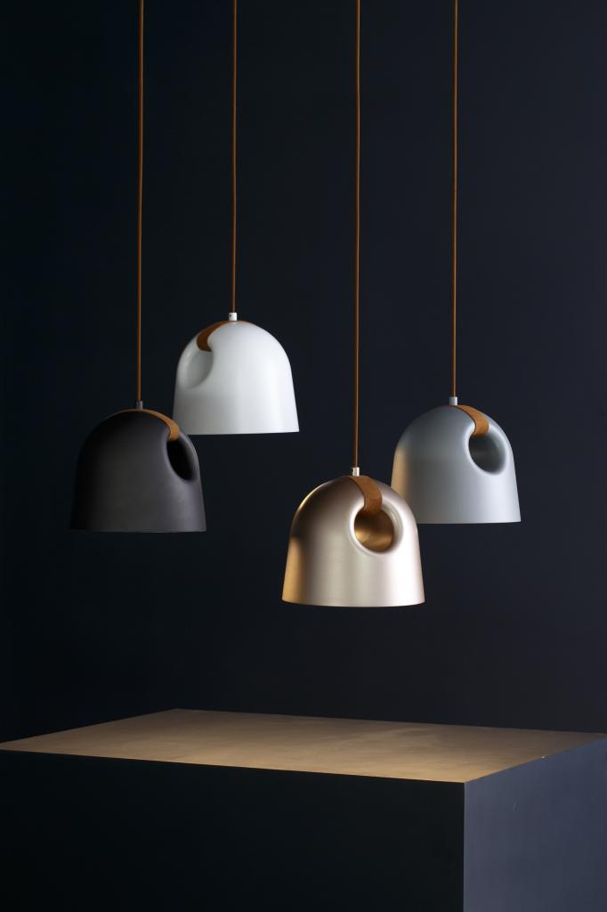

# Linking Ikea Trådfri bulbs to Philips Hue Bridge

So recently I bought this .
I wanted to buy the small version, because it replaces an old lamp in the hallway.
The small version was end of series and could not be delivered, so the [shop](https://shop.d-lightz.com/) offered the bigger version at the same price.

When the lamp arrived, I noticed that it required four E27 bulbs. This was too much light in my hallway and only using 1 or 2 bulbs, did not have a nice effect. A dimmer was too much work and since I did not want to spend my money for four Philips Hue lights, so I decided to buy 4 Trådfri bulbs instead.

[Connecting](https://www.the-ambient.com/how-to/ikea-smart-bulbs-on-philips-hue-app-255) the new Trådfri bulbs was easy, following these steps:
- Reset the Trådfri bulb by switching it on 6 times
- The Trådfri bulb blinks and starts glowing
- Place the bulb near the Philips Hue hub
- "Add Light" in the "Light setup" section of the Philips Hue app "Settings" and "Search" for the Trådfri bulb.

# Limiting max brightness with [hassio]()

Because the manufacturer of the lamp only allows 6W bulbs, we need to limit the brightness of the lamp in order to keep the temperature in the lamp low enough. According to [this test](https://www.youtube.com/watch?v=mg4-O-3Vsn0&ab_channel=AutomateYourLife), the Hue lights are dimming according to a [logarithmic curve](https://www.cnet.com/home/energy-and-utilities/your-smart-bulbs-arent-dimming-the-way-you-think-they-are-heres-why/). 
I compared a Philips Hue bulb with a similar Trådfri bulb and verified that Trådfri bulbs connected to a Philips Hue bridge follow the same logarithmic curve.

| Brightness | Power consumption |
|:----------:|:-----------------:|
| 100 % | 9.5W |
| 75 % | 5 W |
| 50% | 2 W |

So limiting the brightness to 75% should keep the power consumption of the Trådfri bulb below the allowed level of 6W.

After some time, I managed to achieve this for my Trådfri bulb in the office with the following [homeassistant](https://www.home-assistant.io/) automation:

```
- id: '1616691442682'
  alias: Limit Brightness
  description: ''
  trigger:
  - platform: state
    entity_id: light.office_1
  condition:
  - condition: numeric_state
    entity_id: light.office_1
    attribute: brightness
    above: '190'
  action:
  - type: brightness_decrease
    device_id: 494bd232fa14a50d07c6eec3548d0875
    entity_id: light.office_1
    domain: light
  mode: queued
  max: 10
```

Next step is to write a blueprint for all my bulbs in the hallway.